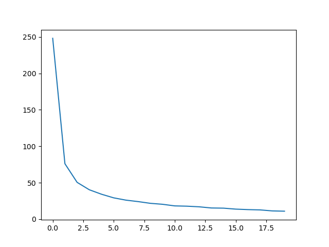
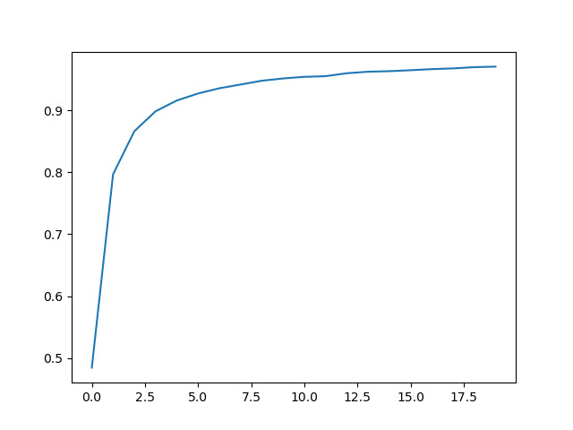
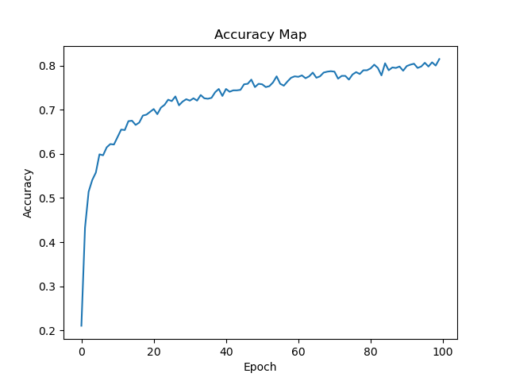
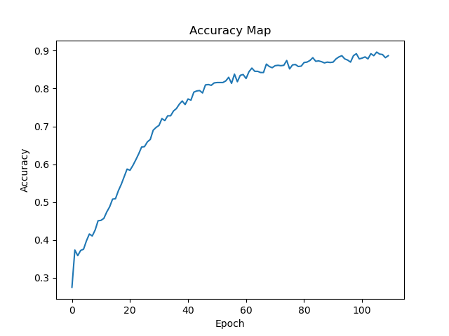

# Simple Image Classification Model (MNIST-style)

## Overview
This repository implements a **complete image classification pipeline** using PyTorch, including:

- Model training (`train.py`)
- Model evaluation (`test.py`)
- Single-image inference (`inference.py`)

The project is designed to be **simple, clean, and easy to extend**, suitable for MNIST-style datasets or custom image classification tasks.

Result training with MNIST

| Models | Loss | Accuracy |
|--------|------|-------------|
|SimpleModel (Custom model)|  |  |

Result training with Fruits datasets
| Models | Loss | Accuracy |
|--------|------|-------------|
|SimpleModel (Custom model)|  |  |
|ShuffleNetMNIST (ShuffleNet pretrained)|  |  |

---

## Model Architecture

The model architecture is summarized using **torchsummary**, showing layer-wise output shapes and parameter counts.

*Model summary generated using torchsummary (input size: 1 × 28 × 28).*

```text
----------------------------------------------------------------
        Layer (type)               Output Shape         Param #
================================================================
            Conv2d-1           [-1, 32, 28, 28]             320
       BatchNorm2d-2           [-1, 32, 28, 28]              64
              ReLU-3           [-1, 32, 28, 28]               0
         MaxPool2d-4           [-1, 32, 14, 14]               0
         ConvBlock-5           [-1, 32, 14, 14]               0
            Conv2d-6           [-1, 64, 14, 14]          18,496
       BatchNorm2d-7           [-1, 64, 14, 14]             128
              ReLU-8           [-1, 64, 14, 14]               0
         MaxPool2d-9             [-1, 64, 7, 7]               0
        ConvBlock-10             [-1, 64, 7, 7]               0
          Dropout-11                 [-1, 3136]               0
           Linear-12                   [-1, 10]          31,370
================================================================
Total params: 50,378
Trainable params: 50,378
Non-trainable params: 0
----------------------------------------------------------------
Input size (MB): 0.00
Forward/backward pass size (MB): 1.03
Params size (MB): 0.19
Estimated Total Size (MB): 1.22
----------------------------------------------------------------
```

---

## Dataset Structure

The dataset should be organized in a **folder-per-class** format:

```text
dataset_root/
├── class1/
│   ├── image_001.jpg
│   ├── image_002.jpg
│   └── ...
├── class2/
│   ├── image_001.jpg
│   └── ...
├── class3/
│   └── ...
```

Example for MNIST:

```text
mnist_dataset/
└── trainingSet/
    ├── 0/
    ├── 1/
    ├── 2/
    └── ...
```

---

## Environment Setup

It is recommended to use **conda** or **virtualenv**.

```bash
pip install -r requirements.txt
```

---

## Training

```bash
python train.py   --dataset path/to/dataset   --epoch number/of/epochs  --checkpoint_folder checkpoints --batch_size num/batchsize   --lr learing rate  --pretrained
```
Example:
```
python train.py --dataset mnist_dataset/trainingSet  --epoch 10 --batch_size 64 --lr 1e-4
```

### Training Arguments

| Argument | Description |
|--------|------------- |
| `--dataset` | Path to the training dataset |
| `--epoch` | Number of training epochs |
| `--batch_size` | Batch size |
| `--lr` | Learning rate |
| `--checkpoint_folder` | Model trained save here |
| `--pretrained` | Use pretrained (ShuffleNet) model |


---

## Evaluation

```bash
python test.py   --test_data mnist_dataset/trainingSet   --model_path checkpoints/SimpleModel.pt   --acc   --cfm
```

### Options
- `--acc` : Compute accuracy
- `--cfm` : Generate confusion matrix

---

## Inference

```bash
python inference.py   --model_path checkpoints/SimpleModel.pt   --image_path image_test/img_1.jpg
```

---

## Visualization features map

```bash
python show_features_map.py   --model_path checkpoints/SimpleModel.pt   --image_path image_test/img_1.jpg
```

---

## Notes
- Model architecture is defined in `models/model.py`
- Dataset loader is implemented in `datasets/data.py`
- The project can be easily adapted to other datasets by changing the dataset directory structure

---
